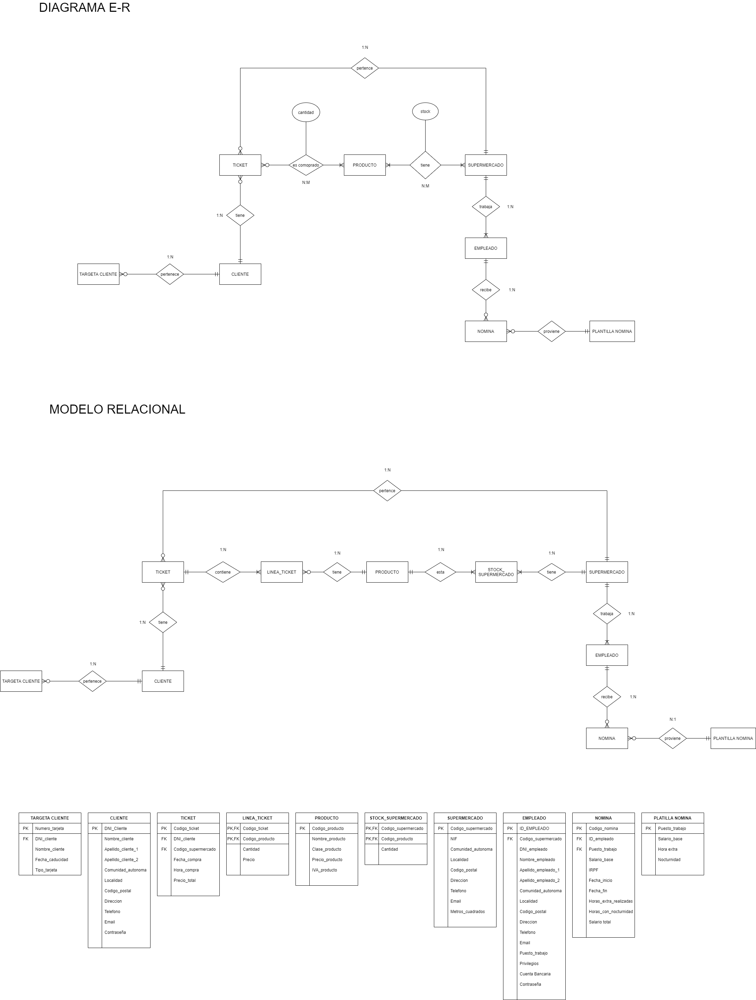

# PROYECTO 3A EVALUACIÓN GRUPO 1

# PRESENTACION:

Este proyecto ha sido creado por alumnos de 1 de DAM del CIFP Borja Moll. Hemos creado un programa para una cadena de supermercados que quería permitir a sus clientes poder comprar sus productos por medio de una aplicación. Aprovechando esto, esa misma cadena nos pidió que esa misma aplicación sirviera para gestionar los supermercados y los empleados de esos supermercados. Siguiendo sus directrices hemos creado un programa que permita hacer todo eso a través de un mismo log in diferenciando si se inicia sesión con un DNI, y por lo tanto será un Cliente, o con una id de empleado, y por lo tanto será un empleado.

# DIARIO DE TRABAJO:

# 24/03/2021

Empezamos el proyecto, empezamos el 1 Sprint. Recogemos los requisitos del programa que nos ha dado el product owner. A partir de estos requisitos empezamos a pensar como será el programa y a crear la base de datos. Creamos el diagrama entidad relación.

# 29/03/2021

Tenemos que pasar el diagrama E-R a modelo relacional. Si nos da tiempo también empezaremos a pensar que clases tendría que tener el programa, su herencia,… y empezar a anotar. Necesitaremos hablar con el product owner para estar seguro de lo que quiere almacenar en la nomina. 

# 30/03/2021

Nos hemos comunicado con el producto owner para estar seguros de que necesita en la tabla nominas. Hemos decidido crear una tabla plantilla para las nominas para que así sean mas fáciles de crear. Intentaremos terminar el modelo relacional hoy y dejar lo mas perfilado posible el documento de las clases y los métodos. Hoy se termina el 1 Sprint.

# 13/04/2021

Empezamos Sprint dos, el objetivo de este Sprint es crear las clases i las tablas e inserts principales de la base de datos. Dividiremos el trabajo i terminaremos de perfilar los cambios que sean necesarios.

# 14/04/2021

Seguimos programando las clases. Hemos estado probando la maquina virtual y la conexión del programa con la base de datos.

# 19/04/2021

He tenido problemas con el servidor, no me dejaba conectarme con mi ip. He tenido que cambiar el nombre del servidor de nuestro usuario de la base de datos. Surgen cambios, como añadir lista compra como arraylist en cliente i añadir una tabla llamada líneas carrito compra en la BBDD para que no se pierda un carrito al salir de la app.

# 20/04/2021

En principio hoy crearemos las tablas. James ayer me entrego el sql con todos los create table, los he revisado para ver que todo estuviera correcto y he añadido la tabla líneas carrito. Hay gente que ha terminado sus clases y gente que no, los que ya han terminado están echando una mano a los otros con sus clases. Las tablas han sido creadas correctamente en la base de datos.

# 21/04/2021

Hoy termina el Sprint 2. Tenemos creadas las tablas de la base de datos. Hoy se tienen que terminar las clases para poder empezar con el siguiente sprint. Empezamos el Sprint 3.

# 26/04/2021

El día 21 ya asignamos las tareas a hacer en este sprint: Crear los métodos, ajustar la base de datos para que devuelva tenga guardado todo lo que necesita el programa y crear los inserts para tener datos guardados con los que trabajar en la base de datos. Seguiremos trabajando en estas tareas y empezaremos a definir un poco la interfaz grafica del programa.

# 27/04/2021

Seguimos igual que el día anterior, hay gente que ya ha terminado sus métodos y se están centrando en crear los inserts. Hemos creado la clase Excepciones, para poder crear nuestras propias excepciones y que tengan un mensaje ya personalizado en un método llamado getMessage. Seguramente tendremos que cambiar la forma en la que habíamos planteado el tema de las conexiones a las base de datos.

# 28/04/2021

Teóricamente hoy termina el Sprint 3, parece que hay gente que no llegara a cumplir sus tares en la fecha limite así que tendremos que alargar este sprint o dejar lo que ha faltado para el siguiente. Realmente no hay problemas de no saber como hacer las tareas, sino falta de tiempo para realizarlas.

# 04/05/2021

Ayer no tuvimos sesión de trabajo ya que explicamos los ficheros. Actualmente hemos empezado el Sprint 4, en el cual ya empezamos a crear frames, hacer métodos para esos frames, seguir creando métodos en las clases ya creadas mas enfocados en el funcionamiento de la interfaz grafica,…. Hemos tenido problemas con la base de datos de la maquina virtual pero ya los hemos solucionado todos. Este Sprint termina día 12.

# 05/05/2021

Vamos progresando. Hoy se nos ha pedido que en el siguiente Sprint todos los programadores hagan una transacción. Ya tenemos algunos frames creados y conectados entre si (login, registro, elegir supermercado) funcionando completamente bien (métodos conectados con la base de datos). Seguimos trabajando y con los objetivos al día.

# 10/05/2021

Los objetivos de este Sprint se van cumpliendo. Aún faltan 2 días y la gran mayoría de métodos están hechos. Hemos avanzado bastante con el frame principal de usuario la cual cosa nos permitirá ser más rápidos en los otros frames, ya que tendremos un ejemplo claro en el que fijarnos.

# 11/05/2021

Seguimos trabajando en nuestros objetivos. Hay gente que ha terminado sus métodos y empieza a desarrollar parte de la interfaz gráfica, otros ayudan a sus compañeros que aún están terminando sus métodos. Estamos teniendo problemas con la interfaz principal, siempre que encontramos la solución para una cosa salen dos problemas más, continuamos trabajando para intentar solucionarlo. Estoy pensando cuales podrían ser las transacciones a realizar en el próximo Sprint.

# 12/05/2021

Ultimo día del Sprint 4. Hoy termina este Sprint i mañana empieza el número 5. Hay gente que no ha terminado aun sus tareas así que tendrán que seguir trabajando en estas durante el siguiente Sprint. Al final hemos solucionado los problemas de ayer con el frame principal así que en principio no tendría que haber problemas con este por ahora. Ya tengo las transacciones que se tendrán que hacer en el siguiente Sprint que empieza hoy. Este Sprint se tendrá que hacer mayoritariamente en casa, ya que solo contaremos con 1 clase para trabajar en el.

# 17/05/2021

Hoy Termina el Sprint 5 y empieza el 6. Hay gente que ya tiene terminado el método y otros que aun van atrasados. Intentaremos ir ayudando a los que van un poco atrasados.

# 18/05/2021

Estamos en el Sprint 6. En este Sprint se trabajará con ficheros, como pidió el profesor. Vamos avanzando con la interfaz grafica también. 

# 19/05/2021

Continuamos con el Sprint 6. La gente ya ha empezado con los ficheros y por ahora no hay problemas. Vamos al día con los objetivos. La interfaz grafica de los clientes va en muy buen camino, se podría decir que ya estamos a punto de terminarla.

# 24/05/2021

Esta semana es la del examen, así que el objetivo es terminar los métodos de las transacciones cuando antes y dejar repasar lo necesario a los miembros del proyecto. Hay gente que ya tiene terminados los métodos y gente que aun va atrasada con los métodos de Sprints anteriores. En cuanto a la interfaz gráfica, la del cliente está a nada de estar terminada. Estos días no avanzaremos demasiado debido al examen, pero este fin de semana debería estar terminada al 100%. 

# 25/05/2021

Se da día libre para preparar repositorio de examen, conexiones a la base de datos,…. A comentar que hemos solucionado un problema que teníamos con la alineación de las diferentes filas tanto en la cesta de compra como en los tickets. Hoy termina el Sprint 6.

# 26/05/2021

Dia del examen.

# 31/05/2021

Este fin de semana he hecho los últimos retoques a la interfaz de usuario y en estos momentos se encuentra 100% funcional. Hoy empieza el Sprint 7, el ultimo, donde tendremos que crear la interfaz de empleado, que es bastante mas simple que la de cliente. Este Sprint se divide en hacer cada uno las interfaces graficas de añadir/eliminar objetos de alguna clase relacionada con esta interfaz y la de crear la interfaz principal. También se tiene que repasar el código hecho para dejarlo comentado correctamente y sin dejarnos ningún print innecesario por consola.

# 01/06/2021

Corregimos el examen, así que no podremos hacer demasiado.

# 02/06/2021

Continuamos con el Sprint 7, el frame principal de empleados esta a punto de estar terminado. Ya hay bastantes clases comentadas y código repasado. Los frames de las opciones del frame principal de empleados están en proceso. Tendremos que trabajar este fin de semana pero creo que tendremos todo terminado y limpio para el día de la presentación.

# 07/06/2021

Sprint 7 terminado. Frames creados y clases comentadas. Se ha adjuntado toda la documentación.

# DIAGRAMA BASE DE DATOS:

# UML:

# CREADORES:

- Joan Francesc Caules
- Josep Fayos
- Aaron Fernandez
- Tamara Fernandez
- James Cañarte
- Jaume Fullana